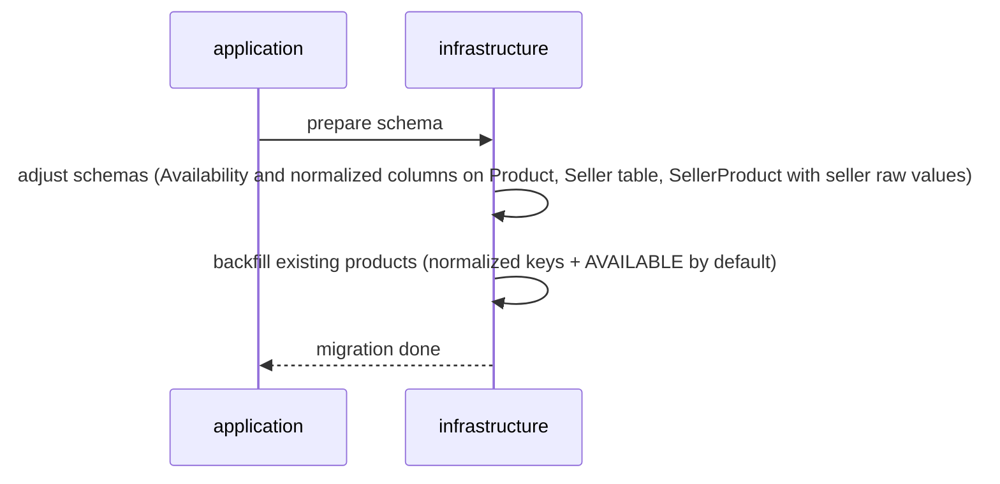
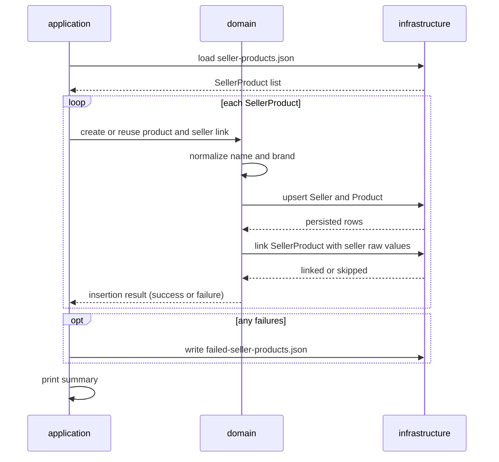

# Catalog Consolidation System

Marketplace catalog consolidation: ingest seller product feeds, deduplicate canonical products by normalized name and brand, and link sellers without changing the existing production catalog.

The job runs in two stages — prepare the schema, then consolidate the feed into a working copy (`catalog-updated.db`).

**Stack:** Java 17 · JDBC / SQLite (no ORM) · Jackson · Maven · Docker

## Solution

### Architecture

The layout is a simplified take on hexagonal architecture: domain rules stay isolated, and the outside world (SQLite, JSON, CLI) plugs in through adapters.

- **`application`** — starts the job: builds dependencies, runs schema preparation, then asks the domain to process each `SellerProduct`. It also prints the processing summary (how many products were created, how many seller links were created or skipped, how many items failed) and, when needed, writes failed items to a JSON file (`--errors-output`).
- **`domain`** — where the business rules live: product/seller modeling, name and brand normalization for matching, and the orchestration that creates or reuses a `Product` and a `Seller` and links them through `SellerProduct`. Unexpected per-item errors are captured as failure results so the batch can continue.
- **`infrastructure`** — talks to the outside world: persists and queries products, sellers, and seller links in SQLite, applies the schema migration, loads `SellerProduct` entries from the JSON feed, and writes failed `SellerProduct`s back out as JSON.

**Stage 1 — Schema migration**



**Stage 2 — Product creation**


For schema and upsert details, see [docs/architecture.md](docs/architecture.md).

### Design decisions

- **Match key:** We treat two `SellerProduct`s as the same product when their **name** and **brand** match after normalization (stored as `NormalizedProductName` + `NormalizedBrand`). **Category is not part of the key** — sellers often classify the same item differently (for example `Electronics` vs `Phones`), so using category in the match would create false duplicates.
- **Normalization:** Before matching, we clean the text: trim and collapse extra spaces, lowercase, remove accents (NFD), and normalize quote characters. Seller names are trimmed and uppercased so `MegaStore` and `megastore` resolve to the same seller.
- **Production safety:** Products already in the catalog stay `AVAILABLE` so the existing store flow is unchanged. New products from seller feeds are inserted as `PENDING` until they can be reviewed or activated.
- **First-wins upsert:** We insert with `ON CONFLICT DO NOTHING`, then `SELECT` the row. If a match already exists, we keep the original catalog name, brand, category, and status. The unique index picks the winner; later writers only read the existing row. That keeps imports idempotent and safer if inserts run in parallel.
- **Seller raw values:** On `SellerProduct` we store the seller’s original name, brand, and category (snapshot). The canonical `Product` row can stay stable while we still know how each seller described the item — useful for later checks or for improving the catalog name from several sellers’ wording.
- **Idempotency:** Unique constraints on the normalized product key and on `(SellerId, SellerProductId)` mean re-running the same feed does not create duplicate products or duplicate seller links.
- **Continue-on-error:** If one `SellerProduct` fails unexpectedly, we record it and keep processing the rest. Failed items go to `--errors-output` (default `failed-seller-products.json`) in the same shape as the input, plus an `ErrorMessage` field.
- **SQL safety:** All runtime queries use `PreparedStatement` with bound parameters — no string concatenation of seller or feed data into SQL.

### Test coverage

What we care about protecting:

- Same product despite whitespace, accents, quotes, or case differences; null brand treated as empty; category ignored for matching
- Existing catalog products are reused instead of duplicated when a `SellerProduct` matches; canonical Name/Category stay first-wins while `SellerProduct` keeps the seller snapshot
- Several sellers can link to one canonical product; seller identity ignores casing; reprocessing the same feed does not duplicate products or links
- Unexpected per-item failures are isolated so the rest of the batch continues; failed items are written as JSON with `ErrorMessage` (a Seller row may still exist from the failed item)
- Empty feeds and unknown JSON fields are tolerated; malformed JSON fails at read time
- Schema migration can run twice without breaking; new imports enter as `PENDING`

Design probes locked by tests (acceptable today, candidates to revisit for unknown feeds): null brands can merge distinct items that share a normalized name; re-sent `SellerProduct`s do not update the stored seller snapshot (`INSERT OR IGNORE`).

### Future evolutions

- **Matching:** name + brand catches formatting noise, but not true synonyms (`Router` vs `Roteador`) or variants that share a commercial identity. A synonym dictionary and stable identifiers (SKU, EAN/GTIN) would tighten deduplication and reduce false merges/splits as the catalog grows
- **Activation:** we introduced `PENDING` for new imports as an optional safety net so they do not surface immediately in a live catalog; a later review step could promote them when ready for sale
- **Scale:** one possible path to more throughput is to publish each `SellerProduct` to a message topic and let several consumers upsert the product/seller tables in parallel, while emitting events so other services can continue the path from intake to sellable (enrichment, review, activation, search indexing)
- **Ops:** separate migrate vs import jobs, metrics on insert/skip rates

## How to run

### Consolidate the catalog

```bash
docker compose up --build
```

**Expect:** a console summary and **`catalog-updated.db`** at the project root. If any `SellerProduct` fails, also **`failed-seller-products.json`** (override with `--errors-output`). Later runs always reuse the same database file; delete it if you want to start again from the original seed.

### Run tests

```bash
docker build --target test -t catalog-consolidation-test .
```

Exit status `0` means success.

For the full Maven output:

```bash
docker run --rm -v "${PWD}:/app" -w /app maven:3.9-eclipse-temurin-17 mvn -B test
```

Optional spot-check after consolidation:

```bash
docker run --rm -v "${PWD}:/data" nouchka/sqlite3 /data/catalog-updated.db \
  "SELECT Availability, COUNT(*) FROM Product GROUP BY Availability;"
```
